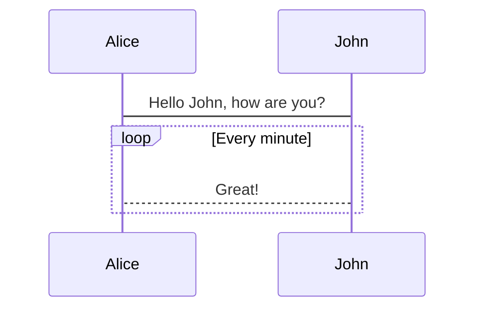

# @renovamen/vuepress-plugin-mermaid

A plugin for adding [Mermaid](https://mermaid-js.github.io) to [VuePress](https://vuepress.vuejs.org/).

&nbsp;

## Installation

Install this plugin with:

```bash
yarn add @renovamen/vuepress-plugin-mermaid
# or
npm install @renovamen/vuepress-plugin-mermaid
```

And add it to your `.vuepress/config.js`:

```js
module.exports = {
  plugins: [
    [
      '@renovamen/vuepress-plugin-mermaid'
    ]
  ]
}
```

&nbsp;

## Usage

Then you can use [Mermaid](https://mermaid-js.github.io) in Markdown:

~~~markdown

~~~

&nbsp;

## License

[MIT](LICENSE)