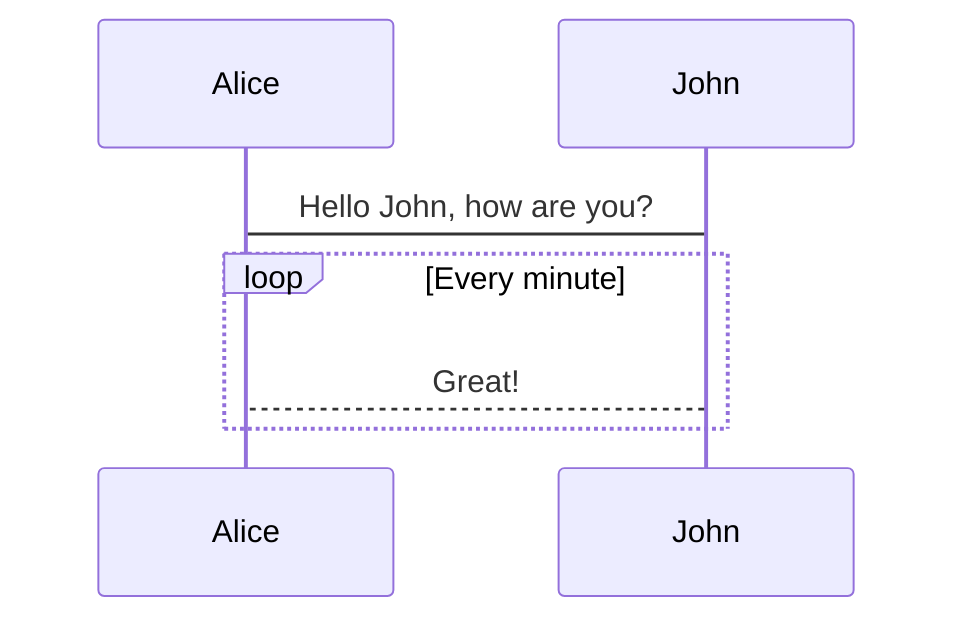

# @renovamen/vuepress-plugin-mermaid

A plugin for adding [Mermaid](https://mermaid-js.github.io) to [VuePress](https://vuepress.vuejs.org/) to create complex diagrams in Markdown.

[Demo](https://vuepress-theme-gungnir.vercel.app/zh/docs/plugins/mermaid.html)


&nbsp;

## Installation

Install this plugin with:

```bash
yarn add @renovamen/vuepress-plugin-mermaid
# or
npm install @renovamen/vuepress-plugin-mermaid
```

Then add it to your `.vuepress/config.js`:

```js
module.exports = {
  plugins: [
    [
      '@renovamen/vuepress-plugin-mermaid'
    ]
  ]
}
```


&nbsp;

## Usage

The token info of the code block should be `mermaid`, for example:

~~~markdown

~~~

Refer to the [documentation of Mermaid](https://mermaid-js.github.io) for more information.


&nbsp;

## License

[MIT](LICENSE)
